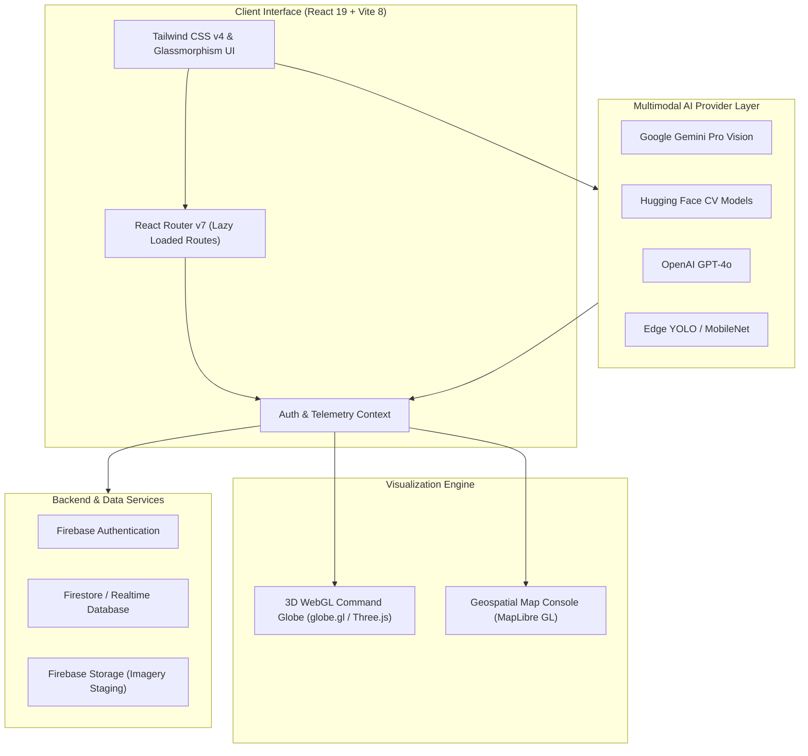

# 🛰️ RescueLens AI

> **AI-Powered Disaster Intelligence & Emergency Response Platform**

[](https://react.dev/)
[](https://www.typescriptlang.org/)
[](https://vitejs.dev/)
[](https://tailwindcss.com/)
[](https://firebase.google.com/)
[](LICENSE)

---

## 📌 Executive Summary

**RescueLens AI** is a next-generation situational intelligence platform engineered for emergency first responders, national disaster management agencies, NGOs, and field volunteers. By fusing **multimodal computer vision**, **geospatial mapping**, and **3D WebGL telemetry visualization**, RescueLens AI enables rapid damage assessment, hazard coordinate extraction, resource allocation, and emergency triage during critical disaster events.

---

## 🌟 Core System Features

### 📡 Multimodal AI Vision & Analysis Pipeline
- **Google Gemini Pro Vision**: High-accuracy damage severity classification and automated executive situational summaries.
- **Hugging Face Hub Models**: Specialized CV pipelines for building damage segmentation, flood boundary tracking, and road block detection.
- **OpenAI GPT-4o Multimodal**: Structured metadata extraction from drone, satellite, and ground responder photography.
- **Local Edge Inference (YOLO / MobileNet)**: Low-latency, offline-capable asset detection for network-degraded field environments.
- **Custom SAR Satellite Imagery Pipeline**: Multispectral SAR tracking for flood expanse and wildfire progression monitoring.

### 🌐 3D WebGL Globe Command Center
- **High-Performance 3D Visualization**: Built with WebGL (`globe.gl`, `cobe`, `three.js`, `ogl`).
- **Interactive Telemetry Layers**: Syncs real-time disaster hotspots, active emergency incidents, and field resource deployments on a 3D Earth model.
- **Sovereign Telemetry Panels**: Click-to-inspect country boundaries with ISO codes, population telemetry, and localized hazard alerts.

### 🗺️ Geospatial Operations Console
- **MapLibre GL & OpenStreetMap Integration**: High-resolution vector map tiles rendered in custom dark mode.
- **Multi-Layer Control System**: Dynamic toggles for Satellite, Topography, Flood Inundation, Hazard Zones, and Rescue Shelters.
- **Interactive Viewport Controls**: Smooth zoom, pan, tilt, full-screen toggle, and coordinate tracking.

### 🚨 Disaster Incident Intake & Reporting
- **4-Step Guided Intake Wizard**: Intake flow covering Incident Categorization, Coordinate Tagging, Media Upload, and Review.
- **Drag-and-Drop File Staging**: Client-side image staging for aerial drone footage, ground photos, and satellite captures.
- **Validation & Verification Engine**: Prevents incomplete reports with field-level schema validation.

### 🆘 Emergency Assistance & Resource Triage
- **Priority-Based Intake Form**: Low, Medium, High, and Critical triage classification for supply requests, medical evacuation, and shelter allocation.
- **Location & Contact Coordination**: GPS coordinate staging and emergency contact verification for field dispatch teams.

---

## 🏗️ System Architecture



---

## 📁 Directory Structure & File Taxonomy

```
RL AI/
├── src/
│   ├── main.tsx                      # StrictMode entrypoint & CSS bootstrap
│   ├── App.tsx                       # Router provider bootstrap
│   ├── index.css                     # Tailwind CSS v4 setup, theme tokens & glassmorphism utilities
│   │
│   ├── routes/
│   │   └── index.tsx                 # Centralized React Router v7 routes setup
│   │
│   ├── services/
│   │   ├── aiProvider.ts             # Multimodal AI model registry & provider configurations
│   │   ├── firebase.ts               # Firebase App, Auth, Analytics & Provider initialization
│   │   └── resource.ts               # Emergency resource data management hooks
│   │
│   ├── context/
│   │   └── AuthContext.tsx           # Global authentication state context
│   │
│   ├── components/                   # Reusable Modular Components
│   │   ├── AppLayout.tsx             # Public marketing site container
│   │   ├── Navbar.tsx                # Sticky glassmorphism header with passive scroll detection
│   │   ├── Footer.tsx                # Public site footer layout
│   │   ├── SEO.tsx                   # Dynamic document title & metadata manager
│   │   ├── GlobeContainer.tsx        # React.lazy performance wrapper for 3D Globe
│   │   ├── Globe3D.tsx               # WebGL Earth with markers and night lights
│   │   │
│   │   ├── auth/                     # Authentication UI Component Suite
│   │   │   ├── AuthLayout.tsx        # Centered frame layout with grid backdrop
│   │   │   ├── AuthCard.tsx          # Framer-motion animated card
│   │   │   ├── AuthInput.tsx         # Accessible inputs with Lucide icons
│   │   │   └── AuthButton.tsx        # Multi-state loading button
│   │   │
│   │   └── dashboard/                # Operational Command Dashboard Components
│   │       ├── DashboardLayout.tsx   # Core layout with Topbar, Sidebar, and Suspense Outlet
│   │       ├── DashboardSidebar.tsx  # Navigation drawer with active route tracking
│   │       ├── DashboardTopbar.tsx   # Executive header with notifications & actions
│   │       │
│   │       ├── incidents/            # Phase 4 Incident Intake Wizard Components
│   │       ├── help/                 # Phase 5 Emergency Assistance Request Components
│   │       ├── maps/                 # Geospatial Operations Console Components
│   │       └── globe/                # 3D Globe Control Center Overlays & Panels
│   │
│   └── pages/                        # View Components
│       ├── LandingPage.tsx           # Marketing site landing page
│       ├── LoginPage.tsx             # Firebase Google & Email Authentication
│       ├── ForgotPasswordPage.tsx    # Password reset view
│       │
│       └── dashboard/                # Command Center Views
│           ├── DashboardHome.tsx     # Operations hub & telemetry status overview
│           ├── MapsPage.tsx          # Geospatial Map Console
│           ├── IncidentsPage.tsx     # Incident management queue
│           ├── NewIncidentPage.tsx   # Disaster Incident Intake Wizard
│           ├── HelpPage.tsx          # Emergency Assistance Center
│           ├── NewHelpRequestPage.tsx# Assistance Request Intake Wizard
│           ├── NewAnalysisPage.tsx   # AI Multimodal Damage Analysis Pipeline
│           └── SettingsPage.tsx      # System preferences & alert settings
│
├── public/                           # Static assets (favicons, clouds, vector icons)
├── package.json                      # Dependencies, scripts, and package management
├── tsconfig.json                     # TypeScript compiler configuration
├── vite.config.ts                    # Vite 8 configuration with React & Tailwind CSS v4 plugins
├── AGENTS.md                         # Vercel React Performance & Engineering Rules
├── DESIGN.md                         # Product Design System Handbook
└── CONTEXT.md                        # Comprehensive Technical Context Handbook
```

---

## 🛠️ Technology Stack

| Domain | Technology | Version | Purpose |
| :--- | :--- | :--- | :--- |
| **Core Framework** | React | `v19.2` | Component UI hierarchy with Concurrent Features |
| **Language** | TypeScript | `v6.0` | Strict type safety & verbatim module syntax |
| **Build Tooling** | Vite | `v8.0` | Next-gen lightning-fast dev server & production bundling |
| **Styling** | Tailwind CSS | `v4.3` | Zero-config native CSS compiler (`@tailwindcss/vite`) |
| **Animations** | Framer Motion & GSAP | `v12.4` / `v3.15` | Hardware-accelerated micro-interactions & UI dynamics |
| **3D Rendering** | Globe.gl / Three.js / Cobe | `v2.46` / `v0.184` | WebGL 3D Globe rendering & satellite telemetry |
| **Geospatial Maps**| MapLibre GL | `v5.24` | High-performance vector map rendering |
| **Auth & Backend** | Firebase | `v12.14` | Authentication, Firestore, and Analytics |
| **Iconography** | Lucide React | `v1.18` | Crisp, scalable UI icons |

---

## ⚡ Getting Started

### Prerequisites
- **Node.js**: `v18.0.0` or higher
- **Package Manager**: `npm` (v9+) or `pnpm` / `yarn` / `bun`

### Installation

1. **Clone the repository**
   ```bash
   git clone https://github.com/shubhamrawat-gh/rescue-lens-ai.git
   cd rescue-lens-ai
   ```

2. **Install dependencies**
   ```bash
   npm install
   ```

3. **Configure Environment Variables**
   Create a `.env` file in the root directory:
   ```env
   # Firebase Configuration
   VITE_FIREBASE_API_KEY=your_firebase_api_key
   VITE_FIREBASE_AUTH_DOMAIN=rescuelens-ai.firebaseapp.com
   VITE_FIREBASE_PROJECT_ID=rescuelens-ai
   VITE_FIREBASE_STORAGE_BUCKET=rescuelens-ai.firebasestorage.app
   VITE_FIREBASE_MESSAGING_SENDER_ID=619746783175
   VITE_FIREBASE_APP_ID=your_firebase_app_id
   VITE_FIREBASE_MEASUREMENT_ID=G-RQE0RN1V0Z

   # AI Provider API Keys (Optional for local testing)
   VITE_GEMINI_API_KEY=your_google_gemini_api_key
   VITE_OPENAI_API_KEY=your_openai_api_key
   ```

4. **Launch Development Server**
   ```bash
   npm run dev
   ```
   Open [http://localhost:5173](http://localhost:5173) in your browser.

---

## 📜 Available NPM Scripts

| Command | Action |
| :--- | :--- |
| `npm run dev` | Starts Vite local development server with HMR |
| `npm run build` | Runs TypeScript typecheck (`tsc -b`) and builds production bundle |
| `npm run preview` | Previews the production build locally |
| `npm run lint` | Runs ESLint analysis across TypeScript & JSX files |

---

## 🎨 Design System & Palette

RescueLens AI utilizes a high-productivity dark mode color system inspired by Linear and Vercel:

| Element | Color Token | Hex Code | Visual Sample |
| :--- | :--- | :--- | :--- |
| **Canvas Background** | `--color-canvas-dark` | `#001e2b` | Deep dark teal canvas |
| **Brand Primary Accent**| `--color-brand-green` | `#00ed64` | Electric vibrant green |
| **Brand Surface Panel**| `--color-surface-dark` | `#0a202c` | Glass card panel background |
| **Subtle Hairline Border**|`--color-hairline-dark`| `#1c2d38` | Fine structural grid borders |
| **Muted Copy** | `--color-muted-dark` | `#a8b3bc` | Secondary telemetry text |

---

## ⚡ Performance Guidelines (Vercel Standards)

This codebase follows strict Vercel React Performance Guidelines ([AGENTS.md](file:///C:/Users/ACER/Desktop/RL%20AI/AGENTS.md)):

- 🚫 **No Async Waterfalls**: Promises are created concurrently and resolved with `Promise.all()`.
- ⚡ **Route-Level Code Splitting**: Heavy modules (such as MapLibre GL and 3D Globe) are split into dynamic chunks via `React.lazy()` and `<Suspense>`.
- 🎯 **Optimized Event Listeners**: Window listeners for scroll events use `{ passive: true }` to avoid layout thrashing.
- 📦 **Direct Tree-Shakable Imports**: Sub-module imports are structured to reduce initial bundle size.

---

## 🗺️ Product Roadmap

- [x] **Phase 1**: Core Architecture & Vite 8 / Tailwind v4 Setup
- [x] **Phase 2**: WebGL 3D Globe & MapLibre GL Geospatial Console
- [x] **Phase 3**: Multimodal AI Vision Provider Configuration (Gemini Pro, GPT-4o, YOLO)
- [x] **Phase 4**: 4-Step Disaster Incident Reporting Intake Wizard
- [x] **Phase 5**: Emergency Assistance Request & Triage Queue System
- [ ] **Phase 6**: Live WebSocket Dispatch Alerts & Push Notifications
- [ ] **Phase 7**: Offline Edge Syncing with PWA Support for Field Responders

---

## 📄 License

Distributed under the **MIT License**. See `LICENSE` for more information.

---

<p align="center">
  Crafted with ❤️ for Disaster Responders worldwide by the <strong>RescueLens AI Team</strong>.
</p>
